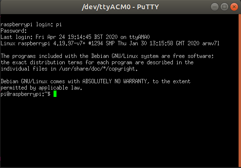
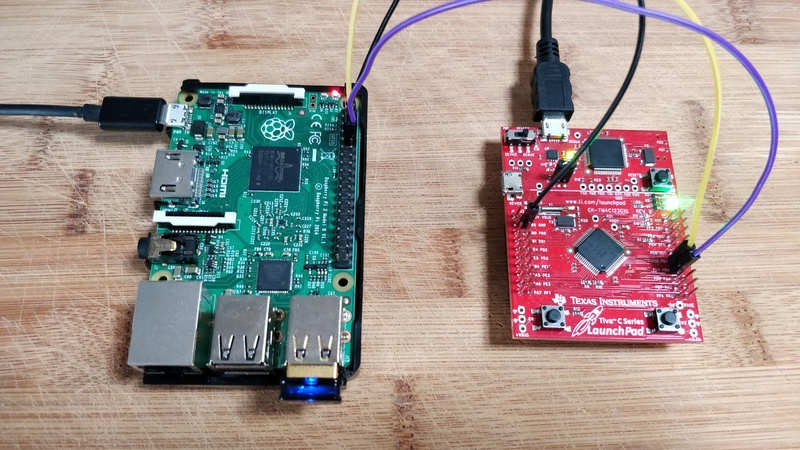

# UART Data Transfer - Serial connection RPi with a Tiva TM4C123G LaunchPad

## Overview

If like me you have a Raspberry Pi and a development board with a USB connector
but no USB-to-serial cable, and you want to connect your RPi through its serial ports, this code can be useful.  
This project was also an excuse to play with FreeRTOS.  

It transfers the data from the RPi to the computer (and in the other direction) through the 
Tiva TM4C123G LaunchPad UART peripherals: UART0 connected to the USB connector and UART3 connected to the RPi.
The baud rate is 115200 bps.

  

Check [https://pinout.xyz](https://pinout.xyz/pinout/uart#) to get the pins right on your RPi.
On the Tiva LaunchPad, PC6 (pin 14) is the receiver pin and PC7 (pin 13) is the transmitter
pin for the UART3. The receiver PC6 should be connected to the RPi transmitter (pin 8) and
the transmitter PC7 should be connected to the RPi receiver (pin 10).

  

This project uses [FreeRTOS](https://www.freertos.org/). 

## Building the project

### Toolset and IDE

The GNU-ARM toolset is used for this project. The IDE Code Composer Studio has been used, but is not necessary.

### FreeRTOS source files

The 4 FreeRTOS source files tasks.c, list.c, queue.c and timers.c are needed for this project. 
They were put into the [FreeRTOS](FreeRTOS) folder. The 2 source files event_groups.c and croutine.c are 
unnecessary for this project.

The source file port.c, the port of FreeRTOS to the MCU TM4C123GH6PM, is also needed, 
and was put in the [FreeRTOS/portable/GCC/ARM_CM4F](FreeRTOS/portable/GCC/ARM_CM4F) folder. 

Finally, the Memory Allocation scheme heap_1 is used because no FreeRTOS object is freed in this porject. 
It was put in [FreeRTOS/portable/MemMang](FreeRTOS/portable/MemMang).  
See [the FreeRTOS doc](https://www.freertos.org/a00111.html) for more details.

### Header files

The header files for FreeRTOS are located in [FreeRTOS/include](FreeRTOS/include) and 
[FreeRTOS/portable/GCC/ARM_CM4F](FreeRTOS/portable/GCC/ARM_CM4F).
The CMSIS header files are located in [CMSIS/Include](CMSIS/Include).  
The path to those 3 directories need to be known by the compiler.
